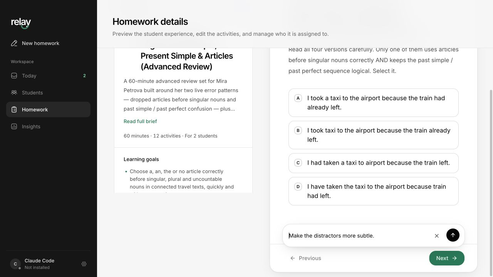

<p align="center">
  
</p>

<p align="center">
  A desktop workspace for one-to-one English teachers. Homework is generated by
  the teacher's own Claude Code CLI, done by students in a browser, and marked
  with the reason behind every answer.
</p>

<p align="center">
  
</p>

---

Relay is two products on one Convex backend:

- **The teacher workspace** — an Electron app that talks to the locally
  authenticated Claude Code CLI. Nothing about generation leaves the teacher's
  Mac except the finished homework.
- **The student player** — a static site served from the Convex deployment. No
  install, no account: a student opens a link and starts.

Because both read the same Convex deployment, the teacher's inbox updates while
the student is still typing.

## The loop

1. **Add a student** with their level, recurring errors, and Miro board. That
   context is stored once and reused forever.
2. **Create homework** — choose one student for a set built on their own evidence,
   or several for a reusable one. Type a sentence about today's lesson; Claude
   also receives the standing context and the focus areas from previous
   submissions.
3. **Review and publish.** Every activity is previewed in the exact wizard the
   student will use, and can be rewritten by asking Claude in plain language.
   Nothing is shared until you publish.
4. **The student works through it** in any browser: option cards, inline blanks
   with the dictionary form in brackets, click-to-connect matching, a whole
   passage with a dropdown at every gap, one flagged phrase to repair, and free
   writing. Progress is saved as they go, and a question can be skipped and
   returned to.
5. **They see their answers at the end** — each one marked, with the expected
   answer and the reason it went the way it did.
6. **The teacher's inbox fills in live** with score, engaged time, tab-aways,
   answer revisions, and an optional Claude summary of what to teach next.

## Homework format

Generated sets mirror a paper worksheet rather than a quiz:

| Piece | What it is |
| --- | --- |
| **Sets** | Activities grouped under a named heading and one instruction line |
| **Cheat sheet** | A collapsible reference the student can open while working |
| **Timeline** | For a tense question, the order the events really happened in |
| **Fix the mistake** | One wrong phrase flagged in a sentence, shown as a diff when marked |
| **Explanations** | Written to be read *after* marking: why the right answer is right |

Marking forgives what is not being taught — case, smart quotes, trailing
punctuation, `did not` vs `didn't` — and reports one verdict per blank, gap or
pair rather than one for a whole activity.

## Requirements

- macOS (Windows and Linux builds exist but are untested)
- **[Claude Code](https://docs.claude.com/en/docs/claude-code) installed and
  signed in.** Generation, activity edits and summaries all run through it.
- A Convex deployment (`npx convex dev` creates one)
- Optional: a Miro MCP server connected to Claude Code, to read lesson boards and
  attach homework to them

## Getting started

```sh
pnpm install
npx convex dev --once   # creates a deployment and writes VITE_CONVEX_URL
pnpm dev                # Convex watcher + the Electron app
```

## Commands

| Command | What it does |
| --- | --- |
| `pnpm dev` | Convex watcher plus the Electron teacher app |
| `pnpm dev:desktop` | Electron only |
| `pnpm dev:web` | Student player on `localhost:5180` |
| `pnpm check` | Typecheck, both test suites, and all three builds |
| `pnpm test:live` | Live tests that call the real Claude CLI (consumes quota) |
| `pnpm host:web` | Build the player and upload it to the development deployment |
| `pnpm deploy:web` | Deploy the production backend and player together |
| `pnpm package:mac` | Build a local, ad-hoc signed `.dmg` and `.zip` into `dist/` |
| `pnpm release` | Build and publish installers to GitHub Releases |

## Installing a build

Releases are **ad-hoc signed**, not notarized, so macOS refuses them on first
open. Right-click the app → **Open** → confirm, or clear the quarantine flag:

```sh
xattr -dr com.apple.quarantine /Applications/Relay.app
```

A Developer ID certificate and notarization remove that step and are what
auto-update requires; see [docs/deployment.md](docs/deployment.md).

## What gets tracked

Per answer: engaged time (paused when the tab loses focus), tab-aways, and how
many times the answer changed. Per submission those roll up into total active
time and lookups. Insights ranks questions by accuracy against average time,
lookup rate and edits — a correct answer that took 90 seconds and five edits is
not the same as one that took 10 — and turns the whole picture into named
findings, filtered by student and period.

## Architecture notes

- Frontend code is organised in **vertical slices** by the domain that owns it —
  `homework/`, `students/`, `submissions/`, `insights/`, `today/`, `claude/`,
  `settings/` — with `components/ui/` for shadcn primitives and `lib/` for
  product-agnostic helpers. See
  [docs/architecture/frontend.md](docs/architecture/frontend.md).
- Two aliases cover everything: `@/*` → `src/*` and `@convex/*` → `convex/*`.
- `src/homework/player/homework-wizard.tsx` is the single step-by-step homework
  surface, shared by the student player and both teacher previews.
- `src/renderer/` is the Electron teacher app; `src/web/` is the student player
  built as a standalone static site.
- `src/main/claude/` owns the Claude runtime. Credentials stay in the Claude CLI;
  the Agent SDK is pointed at the installed executable, and output is constrained
  by a Draft-07 JSON Schema derived from the Zod schema in
  `src/shared/claude.ts`. Miro is reached through the teacher's own MCP server —
  Relay stores no Miro credential.
- `convex/content.ts` holds the question/answer discriminated unions plus
  grading. `assignments.getPublic` strips every answer key before it reaches a
  student's browser, and `submissions.review` requires the student's own resume
  token.
- See [docs/architecture/claude-runtime.md](docs/architecture/claude-runtime.md).

## Deploying

`main` runs the quality gate and then deploys the backend and player. Pushing a
`v*` tag builds and publishes installers for macOS, Windows and Linux.

**Before sharing a build:** every Convex function is currently unauthenticated,
so anyone with an installer can read the deployment it points at. Teacher
authentication is the launch blocker tracked in
[docs/deployment.md](docs/deployment.md).
